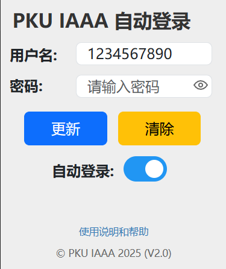

# PKU IAAA 自动登录插件



## 简介
一款用于北京大学统一身份认证（IAAA）的自动登录扩展：自动填写用户名/密码，按页面提示处理普通登录、短信验证与 OTP 认证。

## 安装与使用

### 安装方法

- 下载本项目到本地，并解压
- 打开Chrome/Edge浏览器，进入 `chrome://extensions/`
- 开启"开发者模式"
- 点击"加载已解压的扩展程序"，选择项目文件夹

### 使用指南

#### 初次配置
1. 点击浏览器工具栏中的北大Logo图标
2. 在弹出窗口中输入你的北大账号用户名和密码
3. 点击"保存"按钮
4. 确保"自动登录"开关为开启状态

#### 功能说明
- 保存：保存用户凭据并启用自动登录
- 更新：更新已保存的用户凭据（首次保存后显示）
- 清除：清除所有保存的登录信息并关闭自动登录
- 自动登录开关：在不删除凭据的情况下启用/禁用自动登录

#### 使用流程
1. 配置完成后，访问任何需要IAAA认证的网站
2. 插件会自动填写用户名和密码
3. 根据网站要求的认证方式自动处理：
   - 普通登录：直接完成登录
   - 短信验证：自动发送验证码，等待用户输入
   - OTP认证：显示OTP输入框，等待用户输入
4. 按提示完成剩余步骤即可成功登录

## 项目结构
```
PKU-IAAA-AUTO-LOGIN/
├── manifest.json          # 扩展清单文件
├── popup.html             # 弹窗界面
├── popup.js               # 弹窗逻辑
├── iaaa.js                # 核心自动登录脚本
├── crypto-utils.js        # 密码加密工具
├── jquery-3.7.1.min.js    # jQuery库
├── bootstrap.min.css      # Bootstrap样式（压缩版）
├── Toggle-Switch.css      # 开关组件样式
├── icon*.png              # 扩展图标
└── pic/                   # 文档图片
    └── screenshot.png
```

## 支持的网站
- 北京大学统一身份认证 (iaaa.pku.edu.cn)

## 浏览器兼容性
- **Chrome 88+** (支持 Manifest V3)
- **Microsoft Edge 88+** (支持 Manifest V3)
- **其他基于 Chromium 的现代浏览器**

提示：推荐使用最新版 Chromium 系浏览器以获得最佳体验。

## 隐私与加密
- 使用 AES-GCM(256) 加密存储密码；密钥仅保存在本机（chrome.storage.local），不会随账号同步。
- 加密后的密码存放在 chrome.storage.sync 中，便于同步；因密钥不随之同步，换设备后需重新保存一次密码。
- 彻底移除：点击“清除”，并可在浏览器设置中清理“站点数据/扩展数据”。

## 版本变更
- 2025-10-04：小修，补充扩展页 CSP，增加加密工具防御性初始化。


## 参考

本项目基于 "Cyberoam Auto Login" 开发
